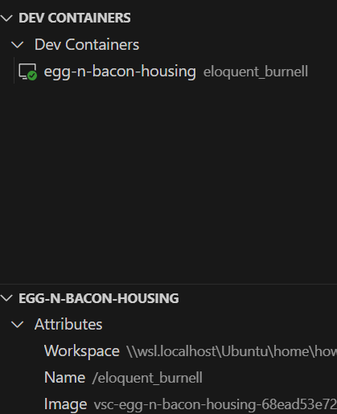

# Housing Agent Assist App

- [Notion Page (invite only)](https://www.notion.so/Housing-Agents-App-0c4bdd40940542b2bcd366207428e517?pvs=4)

## Dev setup

- VSC
    - with remote development package with WSL and docker desktop
    
- codespace
- dvc
    - to use with data setup
    - check .dvc config
    - will need to add aws users setup.

## Secret/API Keys
API key name
- [onemap](https://www.onemap.gov.sg/apidocs/register)
    - ONEMAP_EMAIL
    - ONEMAP_EMAIL_PASSWORD
- gcp gemini access key
    - GOOGLE_API_KEY

## References

- https://github.com/crazy4pi314/conda-devcontainer-demo/tree/main